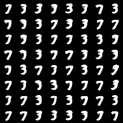

# Variational Autoencoder in PyTorch and Fastai
An implementation of the VAE in pytorch with the fastai data api, applied on MNIST. The notebook is the most comprehensive, but the script is runnable on its own as well. Results from sampling are saved in the `results` directory. 


## Script usage:
```
usage: vae.py [-h] [--batch-size N] [--epochs N] [--no-cuda]
              [--emb-size EMB_SIZE]

VAE MNIST Example

optional arguments:
  -h, --help           show this help message and exit
  --batch-size N       input batch size for training (default: 128)
  --epochs N           number of epochs to train (default: 10)
  --no-cuda            enables CUDA training
  --emb-size EMB_SIZE  size of embedding (default 10)
```

## Results from sampling latent space

